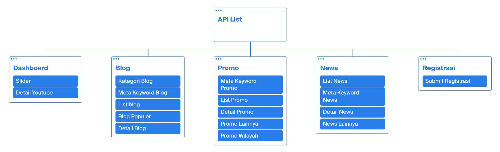

API List
=======================

Sitemap Website HomeNet
--------

.. info::

    Berikut merupakan API List yang digunakan pada website HomeNet
    
    Sitemap dapat dilihat melalui link berikut : Sitemap_

Dashboard
-------------------

___

**Get Data Slider**

- End Point : /api/slider
- Method : GET
- Keterangan : API untuk mendapatkan list slider yang akan di tampilkan pada website 
- Parameter : -
- Response :
.. code-block:: json

    [
        {
            "kdForeign":1,
            "judul":"Promo HomeNet CUMA 165K - Khusus Area Guwang",
            "image":"https:\/\/youtu.be\/ZcAJyjSEWt0",
            "thumbnail":"uploadgambar/maxresdefault.jpg",
            "deskripsi":"Baru nih!! promo HomeNet khusus area GUWANG!!",
            "tipe":"promo",
            "tglPublish":"2022-02-09",
            "tglBuat":"2022-02-09",
            "show":1,
            "deleted":0
        }
    ]

___

**Detail Youtube**

- End Point : /api/detailYoutube
- Method : GET
- Keterangan : API untuk mengambil detail dari url youtube yang di masukkan
- Parameter : url (String)
- Response :
.. code-block:: json

    {
        "ada":true,
        "messages":"Video ditemukan",
        "data":{
            "publishedAt":"2022-02-09T01:04:56Z",
            "channelId":"UCVquEH0LMkTu3WsvmHp92Zw",
            "title":"Promo HomeNet CUMA 165k - Khusus Area Guwang",
            "description":"Promo HomeNet CUMA 165k - Khusus Area Guwang",
            "thumbnails":{
                "default":{
                    "url":"https:\/\/i.ytimg.com\/vi\/ZcAJyjSEWt0\/default.jpg",
                    "width":120,
                    "height":90
                },
                "medium":{
                    "url":"https:\/\/i.ytimg.com\/vi\/ZcAJyjSEWt0\/mqdefault.jpg",
                    "width":320,
                    "height":180
                },
                "high":{
                    "url":"https:\/\/i.ytimg.com\/vi\/ZcAJyjSEWt0\/hqdefault.jpg",
                    "width":480,
                    "height":360
                },
                "standard":{
                    "url":"https:\/\/i.ytimg.com\/vi\/ZcAJyjSEWt0\/sddefault.jpg",
                    "width":640,
                    "height":480
                },
                "maxres":{
                    "url":"https:\/\/i.ytimg.com\/vi\/ZcAJyjSEWt0\/maxresdefault.jpg",
                    "width":1280,
                    "height":720
                }
            },
            "channelTitle":"JINOM",
            "tags":[
                "jinom",
                "podcast",
                "terdepan membuka akses",
                "jinom gianyar",
                "isp bali",
                "isp gianyar"
            ],
            "categoryId":"22",
            "liveBroadcastContent":"none",
            "localized":{
                "title":"Promo HomeNet CUMA 165k - Khusus Area Guwang",
                "description":"Promo HomeNet CUMA 165k - Khusus Area Guwang"
            },
            "defaultAudioLanguage":"id",
            "id_video":"ZcAJyjSEWt0"
        }
    }

Blog
-------------------

___

**Get Kategori Blog**

- End Point : /api/get-kategori-blog-meta/blog/{kdBlog}
- Method : GET
- Keterangan : API untuk mengambil data kategori dari blog yang dituju
- Parameter : kdBlog (Int)
- Response :
.. code-block:: json

    [
        {
            "kdBlogKategori":19,
            "kdBlog":2,
            "kdKategori":2,
            "created_at":"2022-03-01 22:16:39",
            "updated_at":"2022-03-01 22:16:39",
            "kdUser":1,
            "jenisKategori":"HomeNet",
            "tglPublish":"2022-03-01",
            "deleted":0
        }
    ]

___

**Get Meta Keyword Blog**

- End Point : /api/get-blog-meta/blog/{kdBlog}
- Method : GET
- Keterangan : API untuk mengambil data meta keyword dan meta description dari detail blog yang dituju
- Parameter : kdBlog (Int)
- Response :
.. code-block:: json

    [
        {
            "kdBlog":2,
            "kdUser":1,
            "judul":"HomeNet Berikan Dukungan Dana Pembuatan Ogoh-ogoh Untuk STT di Desa Guwang",
            "detail":"detail blog”
            "simpleText":"Ditengah gempuran pandemi Covid-19,",
            "image":"blogImage2.jpg",
            "thumbnail":"blogThumbnail2.jpg",
            "tglBuat":"2022-03-01",
            "publish":1,
            "tglPublish":"2022-03-01",
            "publishBy":"Admin",
            "views":37,
            "deleted":0,
            "created_at":"2022-03-01 22:16:07",
            "updated_at":"2022-03-16 16:44:21",
            "buttonPromosi":null
        }
    ]

___

**List Blog**

- End Point : /api/blog
- Method : GET
- Keterangan : API untuk mengambil list blog yang ada pada website
- Parameter : -
- Response :
.. code-block:: json

    [
        {
            "kdBlog":2,
            "kdUser":1,
            "judul":"HomeNet Berikan Dukungan Dana Pembuatan Ogoh-ogoh Untuk STT di Desa Guwang",
            "detail":"detail”
            "simpleText":"simple text",
            "image":"blogImage2.jpg",
            "thumbnail":"blogThumbnail2.jpg",
            "tglBuat":"2022-03-01",
            "publish":1,
            "tglPublish":"2022-03-01",
            "publishBy":"Admin",
            "views":38,
            "deleted":0,
            "created_at":"2022-03-01 22:16:07",
            "updated_at":"2022-03-16 21:14:20",
            "buttonPromosi":null
        }
    ]

___

**Blog Populer**

- End Point : /api/blog-populer
- Method : GET
- Keterangan : API untuk mengambil list blog yang populer
- Parameter : -
- Response :
.. code-block:: json

    [
        {
            "kdBlog":2,
            "kdUser":1,
            "judul":"HomeNet Berikan Dukungan Dana Pembuatan Ogoh-ogoh Untuk STT di Desa Guwang",
            "detail":"Detail",
            "simpleText":"simpletext",
            "image":"blogImage2.jpg",
            "thumbnail":"blogThumbnail2.jpg",
            "tglBuat":"2022-03-01",
            "publish":1,
            "tglPublish":"2022-03-01",
            "publishBy":"Admin",
            "views":39,
            "deleted":0,
            "created_at":"2022-03-01 22:16:07",
            "updated_at":"2022-03-16 21:31:56",
            "buttonPromosi":null
        }
    ]

___

**Detail Blog**

- End Point : /api/blog-detail/{kdBlog}
- Method : GET
- Keterangan : API untuk mengambil detail blog
- Parameter : kdBlog (Int)
- Response :
.. code-block:: json

    [
        {
            "kdBlog":2,
            "kdUser":1,
            "judul":"HomeNet Berikan Dukungan Dana Pembuatan Ogoh-ogoh Untuk STT di Desa Guwang",
            "detail":"Detail",
            "simpleText":"simpletext",
            "image":"blogImage2.jpg",
            "thumbnail":"blogThumbnail2.jpg",
            "tglBuat":"2022-03-01",
            "publish":1,
            "tglPublish":"2022-03-01",
            "publishBy":"Admin",
            "views":39,
            "deleted":0,
            "created_at":"2022-03-01 22:16:07",
            "updated_at":"2022-03-16 21:31:56",
            "buttonPromosi":null
        }
    ]

___

Promo
-------------------

___

**Meta Keyword Promo**

- End Point : /api/get-promo-meta/promo/{kdPromo}
- Method : GET
- Keterangan : API untuk mengambil data meta keyword dan meta description dari detail promo yang dituju
- Parameter : kdPromo (Int)
- Response :
.. code-block:: json

    [
        {
            "kdPromo":1,
            "kdUser":1,
            "judul":"Promo Area Guwang",
            "detail":"detail",
            "simpleText":"Free registrasi",
            "showPromo":1,
            "image":"gambar.png",
            "thumbnail":" maxresdefault.jpg",
            "tglBuat":"2022-02-01",
            "deleted":0,
            "created_at":"2022-02-02 06:50:46",
            "updated_at":"2022-03-11 15:25:15",
            "buttonPromosi":"Guwang"
        }
    ]

___

**List Promo**

- End Point : /api/list-promo
- Method : GET
- Keterangan : API untuk mengambil data list promo
- Parameter : -
- Response :
.. code-block:: json

    {
        "current_page":1,
        "data":[
            {
                "kdPromo":1,
                "kdUser":1,
                "judul":"Promo HomeNet CUMA 165K - Khusus Area Guwang",
                "detail":"Detail",
                "simpleText":"Baru nih!! promo HomeNet khusus area GUWANG!!",
                "showPromo":1,
                "image":"https:\/\/youtu.be\/ZcAJyjSEWt0",
                "thumbnail":" maxresdefault.jpg",
                "tglBuat":"2022-02-09",
                "deleted":0,
                "created_at":"2022-02-02 06:50:46",
                "updated_at":"2022-03-10 22:43:01",
                "buttonPromosi":"Guwang"
            }
        ],
        "first_page_url":"https:\/\/homenet.id\/api\/list-promo?page=1",
        "from":1,
        "last_page":1,
        "last_page_url":"https:\/\/homenet.id\/api\/list-promo?page=1",
        "next_page_url":null,
        "path":"https:\/\/homenet.id\/api\/list-promo",
        "per_page":"15",
        "prev_page_url":null,
        "to":1,
        "total":1
    }

___

**Detail Promo**

- End Point : /api/promo-detail/{kdPromo}
- Method : GET
- Keterangan : API untuk mengambil detail promo
- Parameter : kdPromo (Int)
- Response :
.. code-block:: json

    [
        {
            "kdPromo":1,
            "kdUser":1,
            "judul":"Promo HomeNet CUMA 165K - Khusus Area Guwang",
            "detail":"Detail",
            "simpleText":"Baru nih!! promo HomeNet khusus area GUWANG!!",
            "showPromo":1,
            "image":"gambar.png",
            "thumbnail":"thumbnail.png",
            "tglBuat":"2022-02-09",
            "deleted":0,
            "created_at":"2022-02-02 06:50:46",
            "updated_at":"2022-03-10 22:43:01",
            "buttonPromosi":"Guwang"
        }
    ]

___

**Promo Lainnya**

- End Point : /api/promo-lainnya/{kdPromo}
- Method : GET
- Keterangan : API untuk mengambil list promo lainnya
- Parameter : kdPromo (Int)
- Response :
.. code-block:: json

    [
        {
            "kdPromo":1,
            "kdUser":1,
            "judul":"Promo HomeNet CUMA 165K - Khusus Area Guwang",
            "detail":"Detail",
            "simpleText":"Baru nih!! promo HomeNet khusus area GUWANG!!",
            "showPromo":1,
            "image":"gambar.png",
            "thumbnail":"thumbnail.png",
            "tglBuat":"2022-02-09",
            "deleted":0,
            "created_at":"2022-02-02 06:50:46",
            "updated_at":"2022-03-10 22:43:01",
            "buttonPromosi":"Guwang"
        }
    ]

___

**Promo Wilayah**

- End Point : /api/getPromoWilayah
- Method : GET
- Keterangan : API untuk mengambil list wilayah yang terkena promo
- Parameter : -
- Response :
.. code-block:: json

    ["Guwang"]

News
-------------------

___

**List News**

- End Point : /api/list-news
- Method : GET
- Keterangan : API untuk mengambil data list news
- Parameter : -
- Response :
.. code-block:: json

    {
        "current_page":1,
        "data":[
            {
                "kdNews":2,
                "kdUser":1,
                "judul":"LAGI! Harley vs Truk Tabrakan di Jalur Tengkorak",
                "detail":"Detail",
                "simpleText":"SimpleText",
                "showNews":1,
                "image":"https:\/\/www.youtube.com\/watch?v=b5MaTpEq-7Y",
                "thumbnail":" maxresdefault.jpg",
                "tglBuat":"2022-03-12",
                "deleted":0,
                "created_at":"2022-03-12 09:10:37",
                "updated_at":"2022-03-16 21:36:31",
                "buttonPromosi":null,
                "views":23
            },
            {
                "kdNews":1,
                "kdUser":1,
                "judul":"HomeNet Berikan Dukungan Dana Pembuatan Ogoh-ogoh",
                "detail":"Detail",
                "simpleText":"",
                "showNews":1,
                "image":"image.png",
                "thumbnail":"hthumbnail.png ",
                "tglBuat":"2022-03-07",
                "deleted":0,
                "created_at":"2022-03-07 14:39:00",
                "updated_at":"2022-03-16 21:36:50",
                "buttonPromosi":"Guwang",
                "views":6
            }
        ],
        "first_page_url":"https:\/\/update.homenet.id\/api\/list-news?page=1",
        "from":1,
        "last_page":1,
        "last_page_url":"https:\/\/update.homenet.id\/api\/list-news?page=1",
        "next_page_url":null,
        "path":"https:\/\/update.homenet.id\/api\/list-news",
        "per_page":"15",
        "prev_page_url":null,
        "to":2,
        "total":2
    }

___

**Meta Keyword News**

- End Point : /api/get-news-meta/news/{kdNews}
- Method : GET
- Keterangan : API untuk mengambil data meta keyword dan meta description dari detail news yang dituju
- Parameter : kdNews (Int)
- Response :
.. code-block:: json

    [
        {
            "kdNews":2,
            "kdUser":1,
            "judul":"LAGI! Harley vs Truk Tabrakan di Jalur Tengkorak Denpasar",
            "detail":"detail ",
            "showNews":1,
            "image":"https:\/\/www.youtube.com\/watch?v=b5MaTpEq-7Y",
            "thumbnail":"maxresdefault.jpg",
            "tglBuat":"2022-03-12",
            "deleted":0,
            "created_at":"2022-03-12 09:10:37",
            "updated_at":"2022-03-16 21:22:10",
            "buttonPromosi":null,
            "views":22
        }
    ]

___

**Detail News**

- End Point : /api/news-detail/{kdNews}
- Method : GET
- Keterangan : API untuk mengambil detail news
- Parameter : kdNews (Int)
- Response :
.. code-block:: json

    [
        {
            "kdNews":1,
            "kdUser":1,
            "judul":"HomeNet Berikan Dukungan Dana Pembuatan Ogoh-ogoh Untuk STT di Desa Guwang",
            "detail":"Detail ",
            "showNews":1,
            "image":"image.png",
            "thumbnail":"thumbnail.png",
            "tglBuat":"2022-03-07",
            "deleted":0,
            "created_at":"2022-03-07 14:39:00",
            "updated_at":"2022-03-16 21:56:37",
            "buttonPromosi":"Guwang",
            "views":7
        }
    ]

___

**News Lainnya**

- End Point : /api/news-lainnya/{kdNews}
- Method : GET
- Keterangan : API untuk mengambil list news lainnya
- Parameter : kdNews (Int)
- Response :
.. code-block:: json

    [
        {
            "kdPromo":1,
            "kdUser":1,
            "judul":"Promo HomeNet CUMA 165K - Khusus Area Guwang",
            "detail":"Detail",
            "simpleText":"Baru nih!! promo HomeNet khusus area GUWANG!!",
            "showPromo":1,
            "image":"gambar.png",
            "thumbnail":"thumbnail.png",
            "tglBuat":"2022-02-09",
            "deleted":0,
            "created_at":"2022-02-02 06:50:46",
            "updated_at":"2022-03-10 22:43:01",
            "buttonPromosi":"Guwang"
        }
    ]

___

Registrasi
-------------------

___

**Registrasi**

- End Point : https://sgm.jinom.net/api/pelanggan/registrasi/homenet
- Method : POST
- Keterangan : API untuk registrasi pelanggan HomeNet pada website
- Parameter : -
- Body :
.. code-block:: json
    {
        lokasi : {
            lat : "-8.612251870527771",
            lng : "115.28450572515273",
            wilayah : "Guwang",
            provinsi : "BALI",
            kabupaten : "KABUPATEN GIANYAR",
            kecamatan : "SUKAWATI",
            kelurahan : "GUWANG",
            end_point_id : "475",
            nama_end_point : "AJ08038",
            panjang_kabel : "146"
        },
        data : {
            presale_id : "10280",
            siteID : "AJ080380016",
            alamat : "Jl. Bima, Guwang, Kec. Sukawati",
            fotoRumah : " 202202121114159411.png",
            paket: {
                paket_id : 3,
                nama_paket : "HomeNet Lite Promo",
                diskon : true,
                harga_sebelum_diskon : 250000,
                persentase_diskon : 34,
                harga_setelah_diskon : 165000,
            },
            registrasi : {
                nama : "Hendra Setiawan",
                no_identitas : "101010101",
                file_identitas : file,
                telepon : "085737779404",
                email : "hendrapgpyph@gmail.com",
                brand_saat_ini : "Indihome",
                bulanan_internet_saat_ini : "250000",
                bukti_pembayaran_terakhir : file
            }
        }
    }

- Response :
.. code-block:: json

    [
        {
            "kdPromo":1,
            "kdUser":1,
            "judul":"Promo HomeNet CUMA 165K - Khusus Area Guwang",
            "detail":"Detail",
            "simpleText":"Baru nih!! promo HomeNet khusus area GUWANG!!",
            "showPromo":1,
            "image":"gambar.png",
            "thumbnail":"thumbnail.png",
            "tglBuat":"2022-02-09",
            "deleted":0,
            "created_at":"2022-02-02 06:50:46",
            "updated_at":"2022-03-10 22:43:01",
            "buttonPromosi":"Guwang"
        }
    ]

.. _Sitemap: https://octopus.do/0a5gypmgkr2g